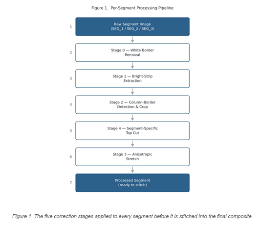
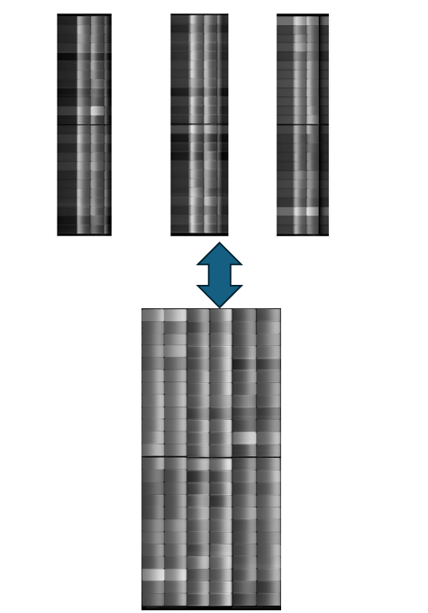
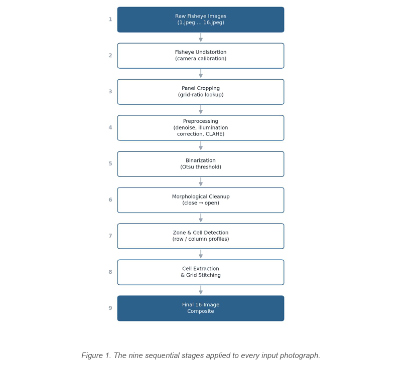
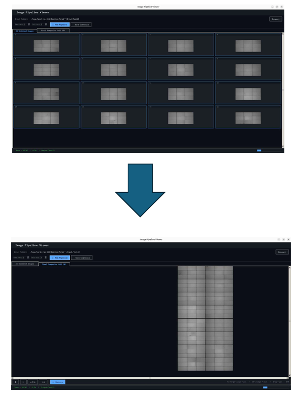
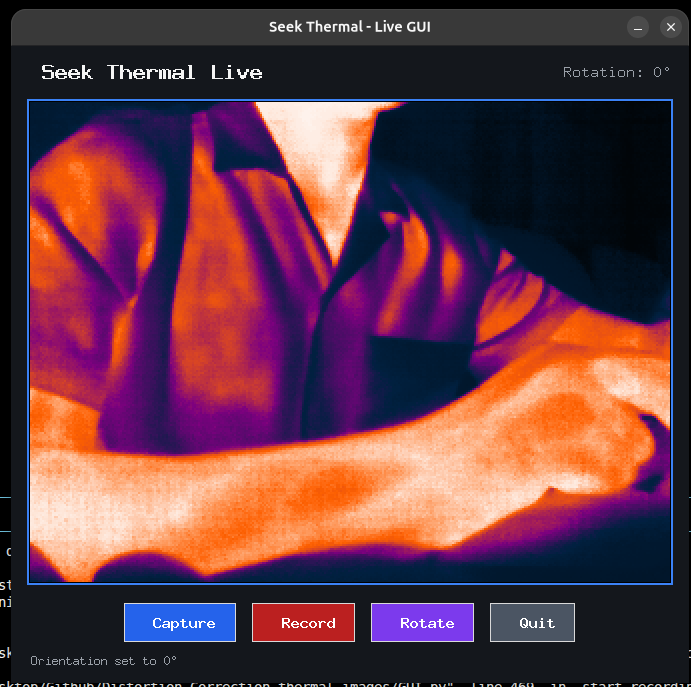

# Panel Imaging & Inspection Toolkit

This repo bundles three independent image-processing pipelines, each for
turning a different kind of camera capture of a panel/module into a clean,
stitched composite — plus an `Images/` folder of reference screenshots and
pipeline diagrams used in the docs below.

> **Note on folder names:** the links below assume the project folders are
> named `topcon-pipeline/`, `panel-grid-pipeline/`, and `seek-thermal-toolkit/`.
> If your actual folder names differ, just update the links — the content
> and images are otherwise unaffected.

```
.
├── topcon-pipeline/         # Stage-based 3-segment scan stitcher
│   └── README.md
├── panel-grid-pipeline/     # Fisheye 16-shot grid/cell extraction + GUI
│   └── README.md
├── seek-thermal-toolkit/    # Seek Thermal capture GUI + preprocessing
│   └── README.md
├── Images/                  # Screenshots & diagrams referenced below
└── README.md                # you are here
```

Each project folder has its own detailed `README.md` covering setup, usage,
and config knobs. This top-level doc is just a map of how the three relate
and what each one produces visually.

---

## 1. Topcon Pipeline

Takes three scan segments (`SEG_1`, `SEG_2`, `SEG_3`) of the same object and
runs each through a five-stage correction pipeline before stitching them
side by side into one image.



*Figure: Stage 0 (white-border removal) → Stage 1 (bright-strip extraction)
→ Stage 2 (column-border detection & crop) → Stage 4 (segment-specific top
cut) → Stage 3 (anisotropic stretch) → processed segment, ready to stitch.*



*Figure: the three corrected segments combine into a single continuous
scan.*

→ See [`topcon-pipeline/README.md`](topcon-pipeline/README.md) for the full
file-by-file breakdown (notebook prototypes → `app.py` → `final_app.py` →
`optimised.py` → `optimesd_final.py`).

---

## 2. Panel Grid Pipeline

Takes 16 fisheye photos of a gridded panel (one per panel position),
undistorts and crops each, detects the individual cells inside, and stitches
everything into one big composite — plus a desktop GUI for running it.



*Figure: raw fisheye images → undistortion → panel cropping → preprocessing
(denoise/illumination/CLAHE) → Otsu binarization → morphological cleanup →
zone & cell detection → cell extraction & grid stitching → final 16-image
composite.*



*Figure: the bundled GUI showing the 16 individual stitched grids (top) and
the resulting full composite (bottom).*

→ See [`panel-grid-pipeline/README.md`](panel-grid-pipeline/README.md) for
the bright-vs-dark image classification logic, the algorithm differences
between the two detection paths, and why `api.py` currently only covers the
bright-image case.

---

## 3. Seek Thermal Toolkit

A live-view capture GUI for a Seek Thermal USB camera, a fisheye calibration
notebook for that camera, and a script that turns captured frames into a
cleaned dataset.



*Figure: the live capture GUI — Capture/Record/Rotate/Quit, with the raw
per-pixel temperature grid always saved to CSV before any image is derived
from it.*

→ See [`seek-thermal-toolkit/README.md`](seek-thermal-toolkit/README.md)
for how `GUI.py`'s captured screenshots feed into
`preprocessing_for_optimised_image.py`, and how `K_and_D_value.ipynb` derives
this camera's undistortion constants.

---

## How the three relate

These are independent toolkits — none of them import from one another — but
they follow the same broad pattern: **undistort/clean a raw capture →
detect structure (strips, cells, or a panel) → crop/correct → stitch into one
composite**, just applied to three different capture setups (a 3-segment
scanner, a 16-shot fisheye rig, and a thermal camera). If you're new to this
repo, the diagrams above are the fastest way to see what each one actually
does before diving into the per-project READMEs.